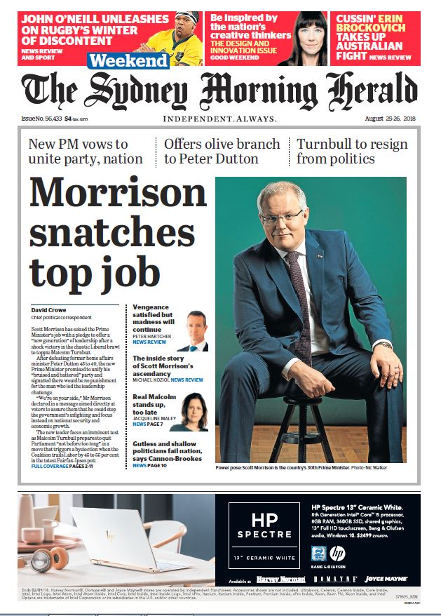
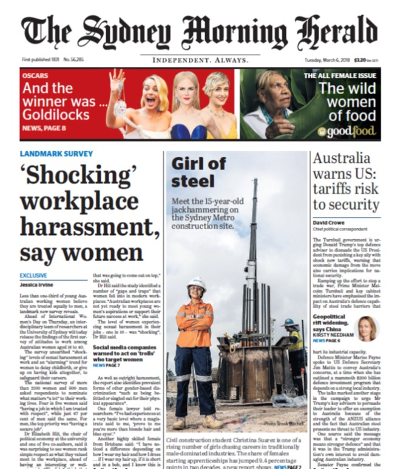

# 🎬 The Cinefile blog 
**Movie reviews no one asked for.**

The Cinefile blog is a movie reviews site that is stylized to look like a newspaper. The premise is that this is a bloggy newspaper that a pretentious *Film Lady* - the author of the site & reviews (aka me) made about her precious movie opinions. She thinks her insights are awfully deep & unique.

The tone I was going for: fake pretentiousness, humour, self-deprecation.

I love writing, so tried to create my own content whenever possible. Film reviews are my own critique, images are primarily sourced from Unsplash, with addition of my own pics.

I also include podcasts that I've listened to, relevant to each review, that are related to that specific movies.

---

## ❓ Why make this project?

Firstly, I have already been toying with the idea of making an organized interactive list of movies that I have seen, that I have not seen, their availability (whether I have them in my home collection or on streaming services), custom ranking, and a very important feature to me - visible presentation, e.g. large posters, plenty of illustrations to accompany the movie posts.

There is a project on my TODO list that includes a search tool to find a movie from TMDB, add it to my watchlist etc. I thought this could be a great FE tool to manage my film lists - I could easily search for new ones, I could see a list of HOT ones this month, I could move them from watch to watched easily. And I could get official meta data, including official film posters from TMDB.

The thing is, I have recently developed a passion for enjoying movies on a more profound level (duh, Film Lady 🙄...). I discovered I really enjoy expressing my opinion on the movies after I have watched them, and even rating them on my own scale. 

Apart from discussing the movie itself, I realized I like to include anectodes, illustrations, and silly unrelated discussions.

So, I needed a space for both listing/organizing movies, as well as having enough freedom to create an article-style movie review for each item on my list.

Of course, one option was to add-on to the TMDB project mentioned earlier and attach blogs to those. But at the time I was in the middle of the React course, practicing React Router v7, where they go through a portfolio project that fetches your blogs stored in markdown format, combines them with custom meta data, puts it all together in a multi-page site. I like to practice my own mini-projects in-between the lessons, so here's how Cinefile blog was born. It seemed perfect for the scope and my goals.

I've decided to use the TMDB project as a search tool, but potentially also link through to the blog site. Oh, and I've got an amazing, detailed json file of my movie data that I will certainly re-use. The idea is:

1. Use TMDB search/discovery tool (with AUTH) to manage my DB(edit,delete...i.e., the CRUD actions). 
2. Use Cinefile as a read-only, presentation-style blogs. I welcome comments and discussion generally, but in this case, following the newspaper principle, I don't see people writing on the margins to comment on an especially infuriating article. 

## 👋 Um, Excuse me, Lady? [Letterboxd](https://letterboxd.com/) exists?..

 Exactly. I have heard about this platform and wondered if all I'm doing is just cloning it. I have [signed up](https://letterboxd.com/sonicakes/) and was pleased to see it had a few essentials I was looking for:

 1. Watchlist.
 2. Watched Movies.
 3. Poster-like presentation (although it took me a while to find out how to switch from teeny-tiny grid items to a slightly larger ones).
 4. Space to write reviews (albeit only a textarea...)
 5. Rating system (only 5 stars though - but you can make half-star ratings too).
 6. Ability to create lists (I have read others' lists but did not try to create my own yet).
 7. Diary/log style - you can view movies as calendar-sorted entries.
 7. Filter tools are there. If you know how to use them.
 7. This was not what I was after, but: a strong feature of social network, ability to follow ppl, like comments, etc.

 Now, there were certain things that I did not enjoy much and that motivated me to go ahead with my own thing.

 1. Review section is just a textarea. So, you are very much limited to the type of content you put, how it's styled etc. I wanted more Rich Text Content situation instead.
 2. I love my posters giant. I know. I'm weird. 
 3. I prefer 10 rating system, and I wanted to choose items to rate with rather than stars.
 4. I wanted a clearer, simpler filtering system that you didn't spend time studying. Actually, I did not even get to that stage yet. I opened a filter dropdown, it was so long that I went *TL;DR* and just manually scrolled my 437 movies. I'm talking clearly visible toggle of watched/not watched, sorting by max 3 categories, indication of how many out of how many movies I've seen, and some pills that I can genre-sort by. Is that too much to ask for? 😀
 5. Main site navigation. Uh - what is the opposite of navigation? I felt *dis-navigated* so to say. I got lost. 

 Anyway, not to turn a README file into Letterboxd criticism, I hope this is enough reasoning to create The Cinefile blog.

 ## Characters, Brand, Aesthetics, Inspiration

 The Cinefile blog accidentally misspells *Cinephile*, which is the official term for someone enjoying the art of cinema. But here we have a *Film Lady* character, who claims to be a Russian Royalty, and she thinks so highly of herself and her opinions; and yet she doesn't even know how to, neither is bothered to check how to, spell the name of her egocentric Gazette.

 I say accidentally misspells, because originally I just sat down to start the project of movie blogs, and the name came to my head. I thought I'd change it later, but realized it's perfect - it combines *CINE*ma *FILE*s & reflects the shallow nature of our fradulent film critic.

 Speaking about the brand themes, there is no unique logo as such, there is a movie icon from Flaticon that I'm using next to the cursive font in the main heading, but instead the Film Lady is the brand - as well as the way the site clearly makes fun of her antics. 

So, why the newspaper aesthetics? I thought I wanted to make my blog reviews a bit 'upper-class' & vintage. I've recently done some pics dressed in my 1920 outfit, in an art deco hotel, and I realized in black and white those would look fantastic. A bit of playing around, 'hey gemini how would those pics look in a newspaper' & voila. The artistic design was decided on.

I have looked up a few websites that inspired me as well:

- [This Russian Site of media company](https://batenka.ru/)
- [This amazing portfolio that looks like a newspaper](https://www.niccolomiranda.com/)

There was a physical medie that had an influence - a good ol' newspaper, mate! The one and only, [Sydney Morning Herald](https://www.smh.com.au/). I was inspired for design of my Front Page by these issues (see screenshots below):




I wanted to make use of grayscale & interaction effects of bringing color back (or parts of it). I really loved the site where only the reds come back, and I intend to research about that for my mobile interactions (currently on hover color fades in, but that's only good for desktop users). I knew I wanted crimson as my highlight (blood! Crimson Peak!). I've discovered crimson is actually fails the readability standard, so I might have to look for an alternative.

So yeah, there's a lot of fun to be had with the newspaper style site. On my future development list, you can see things like:

- effect of turning the pages when you switch routes (visual and potentially sound)
- effect of highlighting lines with a marker when you copy some content or maybe where your mouse traces
- using a library like Framer Motion or AOS alongside Tailwind, trigger the color return as the user scrolls down the page. I've seen this effect on one of the websites, its pretty neat.

## Links

[The Cinefile Blog](https://cinefile-blog.netlify.app/) - deployed live on Netlify.

## 📸 Screenshots

Desktop home

Mobile home

Desktop reviews grid

Desktop Hover When Color Returns

Tablet Width with Genre Filter Selected

Mobile Reviews Grid

Desktop blog detail

Desktop About page

Desktop Contact Page


## 🚀 Features
* **Freeform Reviews:** Full Markdown support for beautiful, long-form film analysis.
* **Film Metadata:** Custom *movies.json* is served from local directory & includes detailed info on ratings, genres, and release years.
* **Responsive Design:** Optimized for reading on the couch (mobile/tablet) or at the desk (laptop/desktop).
* **Search, Filter & Sort:** Quickly find reviews by their name or filter them by genres. Sort by oldest/newest or alphabetical reviews. 
* **See only a portion of reviews at a time:** View the latest reviews first & keep exploring via site pagination.
* **Masonry-style Movie Grid:** See all movies presented in column-like-cards masonry look, each clickable through to the detail page.
* **Article-style Review Presentation:** Read a movie blog as a newspaper article or a page in a book. Completed with 'Related blogs' side-section to suggest a next review.
* **Distinguish Watched VS Watchlist:** Separate your watched movies from not yet seen ones by a simple toggle.
* **Combining Custom Meta Data With Markdown Content:** As long as the name of the post matches the url 'slug', the blog will be served.
* **Contact Form Will Send Messages Directly To The Author:** Currently Contact Form is in progress.
* **Router-based With A Choice Of Layouts:** Multi-page website running on React, React Router v7 & Typescript allows for potential SEO in the future.

## 🛠️ Tech Stack
| Layer | Technology |
| :--- | :--- |
| **Frontend** | React / Typescript |
| **Routing** | React Router v7 |
| **Styling** | Tailwind v4 CSS / Tailwind Typography|
| **Backend** | coming soon |
| **Database** | movies.json hosted @the root of the proj |
| **Authentication** | coming soon |
| **Markdown Support** | React Markdown |
| **Reading Time/Word Count** | Reading Time |
| **Build tool & Dev Server** | Vite |
| **Deployment** | Netlify |
| **Icons** | React Icons - Material Design |
| **Routing support on Netlify** | @netlify/vite-plugin-react-router |

## 🧺 Future Dev/Laundry List

1. Wire Contact Form to send emails to a dedicated cinefile blog address. Probably using Form spree since it's coming up on my classes schedule.

2. Research & implement the 'red standout' effect that will be present on mobile & tablet devices that do not have hover interaction. Whether it's a matter of creating masks for each imagery piece (every time-consuming) or a CSS/JS-based approach (would be great to apply some effects dynamically, bypassing Adobe CC Suite), that is still for me to investigate & play around with.

3. Kind of bouncing from the previous point - it would be great to eventually creat unique cool poster-like art that actually has deep reds color-highlighted, similar to what [this podcast](https://www.nightvalepresents.com/rnghpn9) is doing for each of their movie discussion episode.

4. Document the Design System in Figma. My initial goal was to create full design in Figma but, as I like to do with pet projects, I dove into playing with dev while adjusting my design on the go (so that it underwent about 20 iterations and ofc, I'm like, I should've done design 1st!).

5. Currently all movies, regardless of their watched/not watched status, have 'review pending' if the value of ```'review_provided' = false```. But if I haven't even seen the movie, why there is even a mention of review pending? I believe 'review pending' should be reserved for when author is currently writing/editing a reviw only.

6. Connect to official data from TMDB & FE Management Tool (as described earlier).

7. Dynamic choice of 'Featured Reviews' to appear on the home page. I've commented out that section coz I don't quite like the design of it. Anyway, I was just passing them as an array of items to the respective component, but would be easy to maybe get the most rated or most recent 3-4 to appear as featured. Will def come back to it.

*Not a fan of current 'featured' section, so it's commented out for now.*


8. Wire up the 'Relevant Blogs' ```<aside>``` section, currently hard-coded. Same dynamic choice principle as above would apply.

9. Writing movies meta data in json manually is hella annoying (although I got AI assistance in creating an initial spreadsheet), but maintaining it manually is not a sustainable option. One option is the TMDB Management System project I talked about before, where I auhorize myself & edit movies through FE (movies will go to Mongo or Firebase DB). The other option is transferring meta & content to a CMS. I think after I go through the lessons on CMS (which is upcoming), I will make my choice.

10. Need to optimize those JPGs mate. They take hours to load. 

11. Upload those said images through Cloudinary or similar platform that also autol-optimizes them. I just wanna drag-drop-pop.

12. Fix slight white line on img hover.

13. Display pagination either stuck fixed to the top, or trigger scroll to the viewport top on page change. 

14. If there no synopsis, remove double horizontal lines from BlogCard UI.

15. Style the watched/not watched movie toggle a bit more like Mubi one - jsut one thick lever that I like waay more that the dotted one I have here temporarily.


16. I'd like an ability to choose multiple genres and check matches across all of the selected, not just 1 genre at a time as I've set it up currently. Rarely movies are classified as just 1 genre only, there's usually a list present.

17. Add more sorting options - most rated, by director, by year etc.

18. Want to do something else with the menu rather than just an awkward stack. I've played with a burger, but with only 4 links I feel I want an easier access without the whole burger slide-ins. Need a bit of R&D playtime for this one.

## 🖥️ Running locally

### Prerequisites
* Node.js (v18.0.0 or higher)
* npm or yarn

### Installation
1.  **Clone the repository**
    ```bash
    git clone https://github.com/sonicakes/cinefile-blog
    cd cinefile-blog
    ```

2.  **Install dependencies**
    ```bash
    npm install
    ```

4.  **Run the development server**
    ```bash
    npm run dev
    ```
    Open http://localhost:5173 to see the magic happen.


